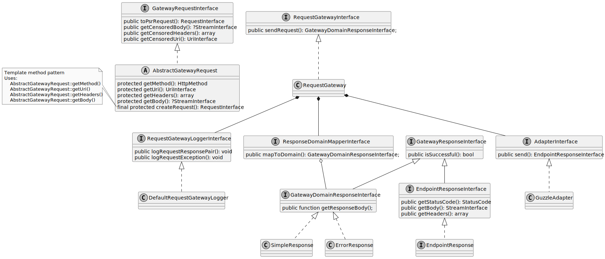

`/`[Home](/service-layer)`/`[1.0](/service-layer/docs/1.0)`/`[Basic concepts](03-basic-concepts.html)

# Basic concepts
Having in mind definition of a SOA and also good practices of a software 
development we have designed Service layer around a few standard principles:
* Reusability
* Encapsulation
* Easy configuration
* Extensibility
* Separation of concerns

## Logical components
* [GatewayRequestInterface](../../src/Transport/Request/GatewayRequestInterface.php)
* [AdapterInterface](../../src/Adapter/AdapterInterface.php)
* [GatewayInterface](../../src/Transport/GatewayInterface.php)
* [ResponseDomainMapperInterface](../../src/Mapper/ResponseDomainMapperInterface.php)
* [LoggerInterface](../../src/Transport/Logging/RequestGatewayLoggerInterface.php)

## Core ideas
* [Request](../../src/Transport/Request/GatewayRequestInterface.php) contract represents basic contract
for wrapping mandatory parameters for service execution - endpoint URL, headers, request body and HTTP method.
Reusability is ensured by name of a request - because it contains all necessary information and
is properly named, it can be initialized and reused in any place.
* [Response](../../src/Response/GatewayResponseInterface.php) minimalistic contract represents any response
that can be emitted from adapter context. Because there are many differences in between
connection response and domain response, we have defined two separate contracts for each case:
  * [EndpointResponse](../../src/Response/Connection/EndpointResponseInterface.php) represents connection response
context agnostic response, that only knows whether the request was successful (by reading HTTP status code)
and has access to the response body.
  * [DomainResponseInterface](../../src/Response/Domain/GatewayDomainResponseInterface.php) represents domain response wrapper
that is able to retrieve specific domain object.
* [Adapter](../../src/Adapter/AdapterInterface.php) contract represents wrapper for any adapter capable of sending of a HTTP requests. 
* [Mapper](../../src/Mapper/ResponseDomainMapperInterface.php) contract represents a component 
capable of mapping [EndpointResponse](../../src/Response/Connection/EndpointResponseInterface.php) into [DomainResponseInterface](../../src/Response/Domain/GatewayDomainResponseInterface.php)
* [GatewayUseCase](../../src/Registry/GatewayUseCase.php) contract represents one specific use 
case - request with all the necessary configuration and means to override its one time configuration. 
* [GatewayUseCaseRegistry](../../src/Registry/GatewayUseCaseRegistry.php) contract represents registry of gateway use cases
and predefines required structure for the necessary configuration with the capability to override each part of a communication.

## Model
In the following extended model the core list of classes is shown along with their relations:

